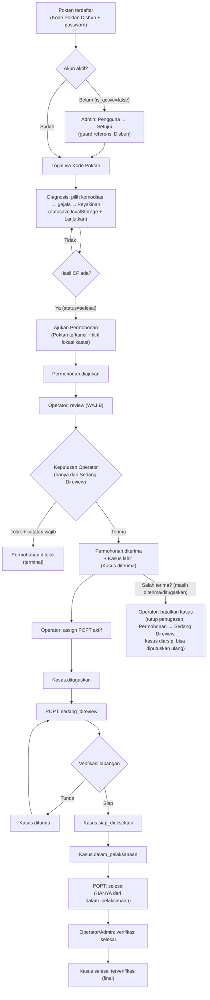

# SIPAKARBUN M2 — Flowchart Diagnosis & Penanganan Kasus

Alur end-to-end Mahasiswa 2: Poktan → Diagnosis → Permohonan → Operator → POPT → Penanganan → Selesai.

> Catatan vocabulary: status `diterima` dan `sedang_direview` muncul di DUA
> tabel dengan makna berbeda (permohonan vs kasus). Flowchart memakai prefix
> `Permohonan.` / `Kasus.` agar tidak tertukar. Kasus tidak mengenal status
> `ditolak` — penolakan hanya terjadi di level permohonan.

## Gate penting

| Titik | Aturan |
|---|---|
| Diagnosis → Permohonan | Diagnosis harus milik sendiri + `status=selesai` + punya hasil (`PermohonanService`) |
| Permohonan → review | `review()` mengubah `diajukan` → `sedang_direview` + mencatat reviewer |
| Permohonan → Kasus | Hanya via `terima()` dari `sedang_direview` (tanpa review = 422); lahir `Kasus.diterima` |
| Kasus salah terima | `batalkanKasus()` hanya saat `diterima`/`ditugaskan`: penugasan dicabut, permohonan → `sedang_direview`, keputusan dihapus, kasus soft-delete, kode lama tetap dipakai (bisa diputuskan ulang jadi kasus baru) |
| Kasus.diterima → ditugaskan | Hanya via `assignPopt()` oleh Admin/Operator ke user `popt` aktif |
| Progres kasus | POPT pemilik penugasan aktif ATAU Admin/Operator (intervensi), mengikuti `config/kasus.php` transitions; `selesai` hanya dari `dalam_pelaksanaan` |
| Kasus.selesai | Belum final sampai `verifikasiSelesai()` oleh Admin/Operator (`verified_by/at`); Poktan/POPT melihat badge verifikasi |

## Padanan vocabulary M2 ↔ kontrak M3

| M2 (`config/kasus.php`) | M3 (kontrak API) |
|---|---|
| `ditugaskan` | `assigned` |
| `sedang_direview` | `under_review` |
| `siap_dieksekusi` | `ready` |
| `dalam_pelaksanaan` | `in_progress` |
| `selesai` | `completed` |
| `ditunda` | `deferred` |
| `diterima` | `accepted` |

Sumber state machine: `config/kasus.php`, penegak `StatusTransitionService`.
